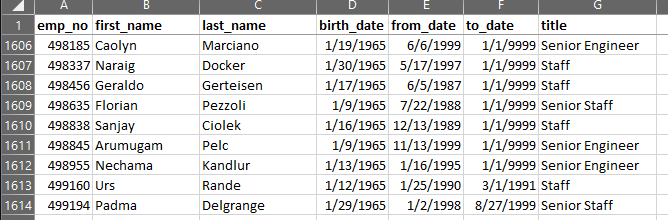

# Pewlett Hackard Analysis

## Overview
The purpose of the analysis was to use SQL to generate queries to determine the number of retiring employees (born between 1952-1955) by job title as well as identify employees (born in 1965) who are eligibile for participation in a mentorship program. Finally, a report was generated to help prepare management for the "silver tsunami" coming with many of the senior employees reaching their retirement age.

## Results
1. **There are 133,776 total titles**  
There are many entries for some retirement-ready employees since they have been at Pewlett Hackard for many years and have gone through multiple title changes. These individuals account for over one-third of all of the company's 300,024 employees. 

2. **There are 90,398 employees about to retire**  
Out of the 300,024 total employees at Pewlett Hackard, it was found that out of the 90,398 individuals ready for retirement, 43,377 title changes occurred. 

3. **The majority of retirement-ready individuals are Senior Engineer or higher**  
There are 88,635 employees who are at least Senior Engineer, Staff, Senior Staff, or Technique Leader. The rest are Assistant Engineer and Engineer level. 

4. **There are 1,940 employees who qualify for the mentorship program**  
Explanation about point #4 goes here. 

## Summary

- **How many roles will need to be filled as the "silver tsunami" begins to make an impact?**  
    From running a query on the number of retiring employees, there are 90,398 individuals ready for retirement. To prepare for their absence, there will need to be that many positions filled. 
    

- **Are there enough qualified, retirement-ready employees in the departments to mentor the next generation of Pewlett Hackard employees?**  
    A "qualified" employee may be considered one that is Senior Engineer, Staff, Senior Staff, or Technique Leader. There are 1,940 total employees eligible for the mentorship program, but those that are "qualified" account for 1,613 of them. Since there are 300,024 total employees, that would mean that each qualified, retirement-ready individual would have to mentor around 200 other Pewlett Hackard employees, which is definitely **not** enough to mentor the next generation of the staff.  
    

